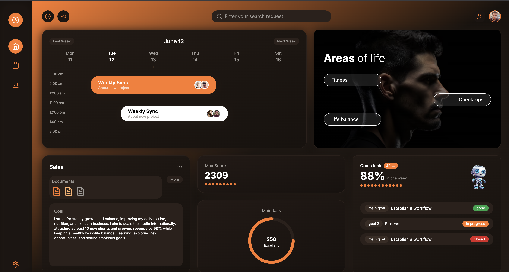

# AnalyticsHub Dashboard



A modern, visually stunning analytics dashboard built with Next.js, TypeScript, and Tailwind CSS. This project features a beautiful dark/orange theme, a calendar scheduler, goal tracking, and more—designed to match premium UI inspiration.

## Features

- 📅 Interactive calendar/schedule widget
- 🧑‍💻 Sidebar navigation with icons
- 🎯 Goal/task tracking and progress
- 🧠 AI Assistant card
- 🟠 Modern dark/orange theme
- ⚡ Responsive and fast (Next.js 14)
- 🖼️ Custom avatars and images

## Getting Started

### Prerequisites
- Node.js 18+
- npm or yarn

### Installation
1. Clone the repository:
   ```bash
   git clone https://github.com/ImageGrabber/AnalyticsHub.git
   cd AnalyticsHub
   ```
2. Install dependencies:
   ```bash
   npm install
   # or
   yarn install
   ```
3. Run the development server:
   ```bash
   npm run dev
   # or
   yarn dev
   ```
4. Open [http://localhost:3000](http://localhost:3000) in your browser.

## Project Structure

```
AnalyticsHub/
├── public/
├── screenshots/
│   └── dashboard-sample.png   # Dashboard screenshot
├── src/
│   └── app/
│       ├── layout.tsx
│       ├── page.tsx
│       └── globals.css
├── .gitignore
├── package.json
├── tailwind.config.js
├── tsconfig.json
└── README.md
```

## Customization
- **Theme:** Edit `tailwind.config.js` and `globals.css` for colors and fonts.
- **Widgets:** Modify `src/app/page.tsx` to add or change dashboard cards.
- **Images:** Replace avatars or background images in the code or add your own to `public/`.

## License
MIT

---

> **UI inspired by premium dashboard concepts. For learning and demo purposes.** 